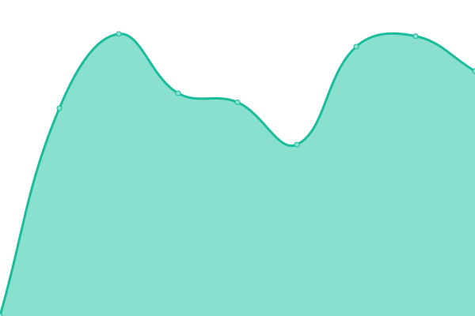

# [📈 Live Status](https://cbtsite.github.io/status): <!--live status--> **🟧 Partial outage**

This repository contains the open-source uptime monitor and status page for [cbtsite](https://cbtsite.github.io/status), powered by [Upptime](https://github.com/upptime/upptime).

With [Upptime](https://upptime.js.org), you can get your own unlimited and free uptime monitor and status page, powered entirely by a GitHub repository. We use [Issues](https://github.com/cbtsite/status/issues) as incident reports, [Actions](https://github.com/cbtsite/status/actions) as uptime monitors, and [Pages](https://cbtsite.github.io/status) for the status page.

<!--start: status pages-->
<!-- This summary is generated by Upptime (https://github.com/upptime/upptime) -->
<!-- Do not edit this manually, your changes will be overwritten -->
<!-- prettier-ignore -->
| URL | Status | History | Response Time | Uptime |
| --- | ------ | ------- | ------------- | ------ |
|  [CBT Site](https://cbtsite.github.io) | 🟩 Up | [cbt-site.yml](https://github.com/cbtsite/status/commits/HEAD/history/cbt-site.yml) | 

 82ms
     
 | 

<a href="https://cbtsite.github.io/status/history/cbt-site">100.00%</a>
    

|  [CBT Online](sman8tamsel.com) | 🟩 Up | [cbt-online.yml](https://github.com/cbtsite/status/commits/HEAD/history/cbt-online.yml) | 

 204ms
     
 | 

<a href="https://cbtsite.github.io/status/history/cbt-online">100.00%</a>
    

|  [Pusat Bantuan](http://cbtsite.tawk.help) | 🟩 Up | [pusat-bantuan.yml](https://github.com/cbtsite/status/commits/HEAD/history/pusat-bantuan.yml) | 

 434ms
     
 | 

<a href="https://cbtsite.github.io/status/history/pusat-bantuan">100.00%</a>
    

|  [Mutaba'ah Online](https://survey.sman8tamsel.com) | 🟥 Down | [mutaba-ah-online.yml](https://github.com/cbtsite/status/commits/HEAD/history/mutaba-ah-online.yml) | 

 965ms
     
 | 

<a href="https://cbtsite.github.io/status/history/mutaba-ah-online">100.00%</a>
    

|  [Ramadhan Bersahaja](https://ramadhan.sman8tamsel.com) | 🟩 Up | [ramadhan-bersahaja.yml](https://github.com/cbtsite/status/commits/HEAD/history/ramadhan-bersahaja.yml) | 

 1552ms
     
 | 

<a href="https://cbtsite.github.io/status/history/ramadhan-bersahaja">100.00%</a>
    

|  [Analytics](https://io.sman8tamsel.com) | 🟩 Up | [analytics.yml](https://github.com/cbtsite/status/commits/HEAD/history/analytics.yml) | 

 1885ms
     
 | 

<a href="https://cbtsite.github.io/status/history/analytics">100.00%</a>
    

|  [Mirrors](https://mirror.sman8tamsel.com) | 🟩 Up | [mirrors.yml](https://github.com/cbtsite/status/commits/HEAD/history/mirrors.yml) | 

 893ms
     
 | 

<a href="https://cbtsite.github.io/status/history/mirrors">100.00%</a>
    

|  [SMTP endpoint](http://mail1.sman8tamsel.com) | 🟩 Up | [smtp-endpoint.yml](https://github.com/cbtsite/status/commits/HEAD/history/smtp-endpoint.yml) | 

 810ms
     
 | 

<a href="https://cbtsite.github.io/status/history/smtp-endpoint">100.00%</a>
    

|  [LiveChat endpoint](http://tawk.to) | 🟩 Up | [live-chat-endpoint.yml](https://github.com/cbtsite/status/commits/HEAD/history/live-chat-endpoint.yml) | 

 388ms
     
 | 

<a href="https://cbtsite.github.io/status/history/live-chat-endpoint">100.00%</a>
    

|  [OpenVPN endpoint](sman8tamsel.com) | 🟩 Up | [open-vpn-endpoint.yml](https://github.com/cbtsite/status/commits/HEAD/history/open-vpn-endpoint.yml) | 

 204ms
     
 | 

<a href="https://cbtsite.github.io/status/history/open-vpn-endpoint">100.00%</a>
    

|  [IPInfo enpoint](https://ipinfo.io/json) | 🟩 Up | [ip-info-enpoint.yml](https://github.com/cbtsite/status/commits/HEAD/history/ip-info-enpoint.yml) | 

 111ms
     
 | 

<a href="https://cbtsite.github.io/status/history/ip-info-enpoint">100.00%</a>
    

|  [OpenAI endpoint](https://api.openai.com/v1/chat/completions) | 🟩 Up | [open-ai-endpoint.yml](https://github.com/cbtsite/status/commits/HEAD/history/open-ai-endpoint.yml) | 

 83ms
     
 | 

<a href="https://cbtsite.github.io/status/history/open-ai-endpoint">100.00%</a>
    

|  [Licensing endpoint](https://sl.sman8tamsel.com) | 🟩 Up | [licensing-endpoint.yml](https://github.com/cbtsite/status/commits/HEAD/history/licensing-endpoint.yml) | 

 1659ms
     
 | 

<a href="https://cbtsite.github.io/status/history/licensing-endpoint">100.00%</a>
    

<!--end: status pages-->

[**Visit our status website →**](https://cbtsite.github.io/status)

## 📄 License

- Powered by: [Upptime](https://github.com/upptime/upptime)
- Code: [MIT](./LICENSE) © [Anand Chowdhary](https://anandchowdhary.com), supported by [Pabio](https://pabio.com)
- Data in the `./history` directory: [Open Database License](https://opendatacommons.org/licenses/odbl/1-0/)
